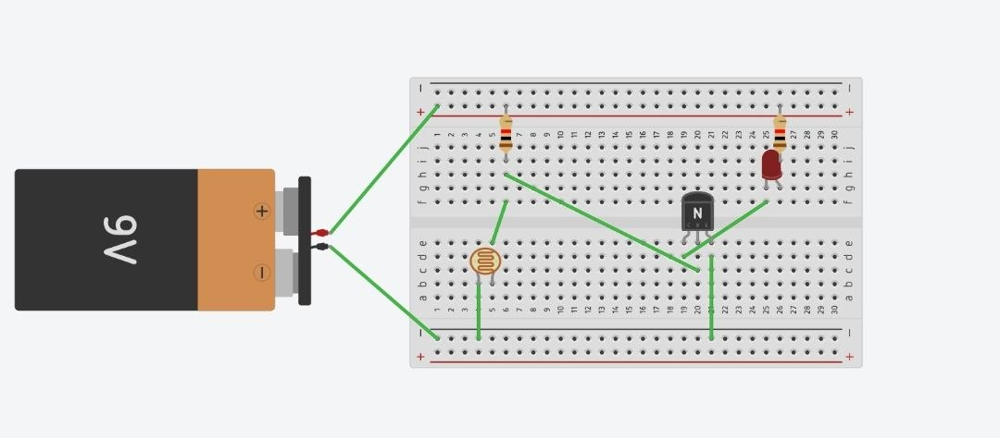
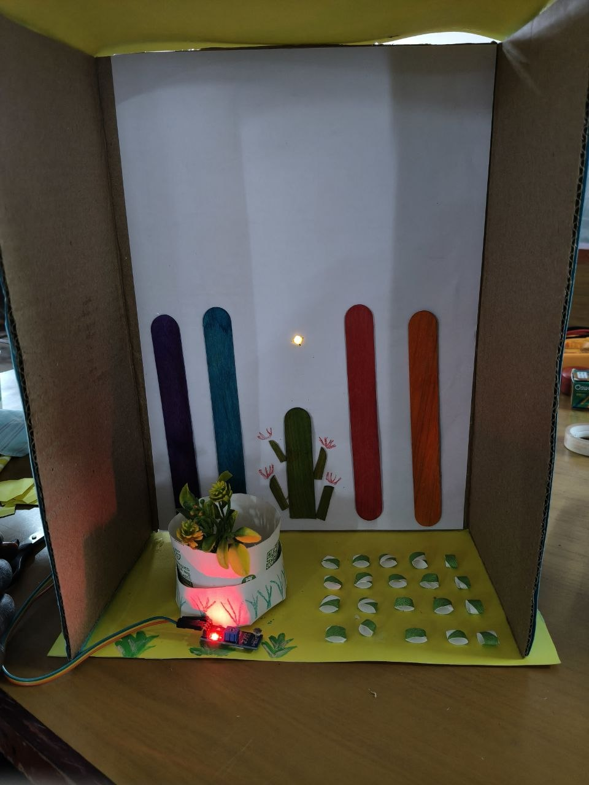

PULSE TEAM:

DESCRIPTION

              Automatic Agriculture Light Detector is an electronic system that detects the light level         in an agricultural field. When the surrounding light becomes low, the system automatically turns ON the light, and when sufficient light is available, it turns OFF the light. This helps provide proper lighting for plants while reducing unnecessary power consumption.

MATERIALS USED

➤ LDR (Light Dependent Resistor)  
➤ LED / LED lamp  
➤ Transistor or relay module  
➤ Battery / power supply  
➤ Resistors  
➤ Connecting wires  
➤ Breadboard  
➤ Agriculture/plant setup

PROCEDURE

1\. Circuit Preparation

          ➤ Connect the LDR and resistor to form a light-sensing circuit. Arrange the components   
               on a breadboard.

2\. Light Detection

          ➤ Place the LDR in an open position so that it can sense the surrounding light level.

3\. Automatic Light Control

          ➤ Connect the sensor circuit to an LED or lamp. Adjust the circuit so that the lamp turns   
               ON when the light level is low and OFF when the light level is sufficient.

4\. Testing & Installation

          ➤ Cover the LDR to simulate low-light conditions and check whether the lamp turns ON.    
               Finally, place the system near the agricultural plants for automatic operation.

CIRCUIT  

RESULT

CONCLUSION

               The Automatic Agriculture Light Detector was successfully designed and tested. It  
          automatically provides lighting during low-light conditions, helping maintain suitable     
          illumination    for agricultural plants while reducing unnecessary energy usage.  

